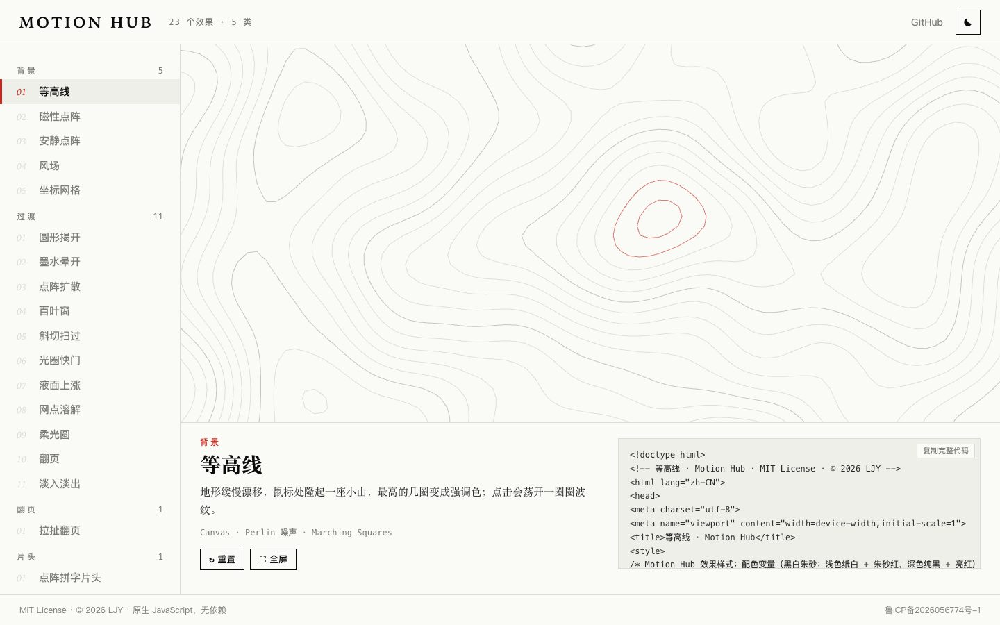
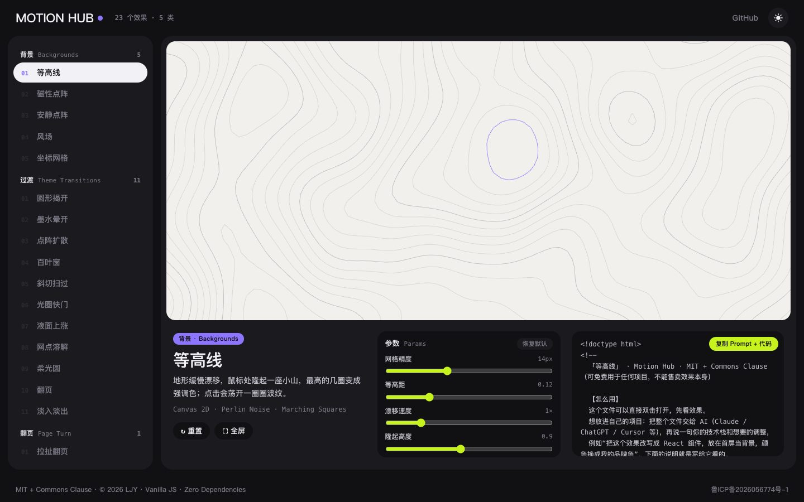
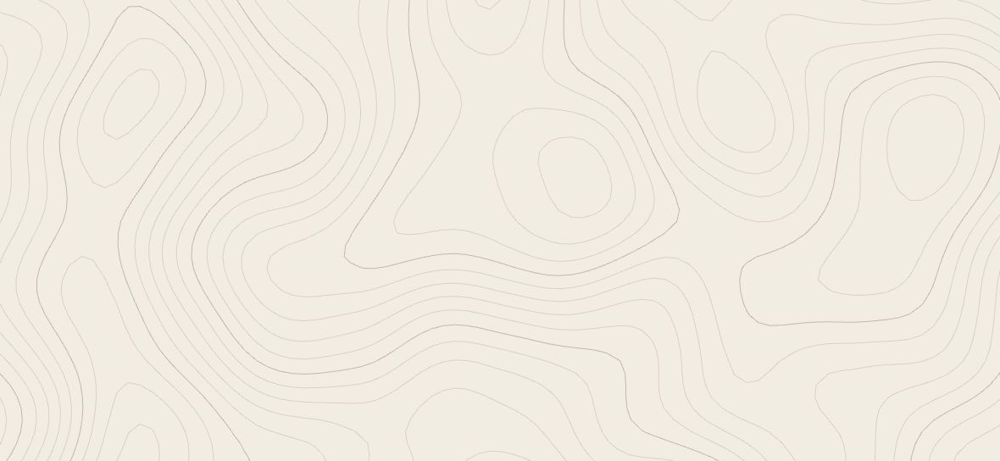
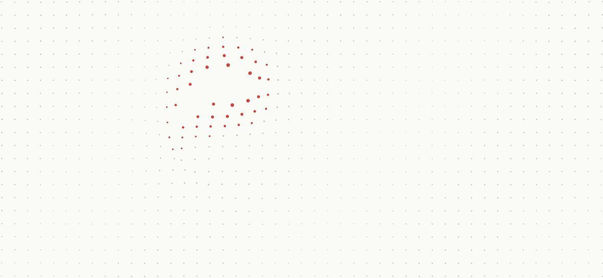
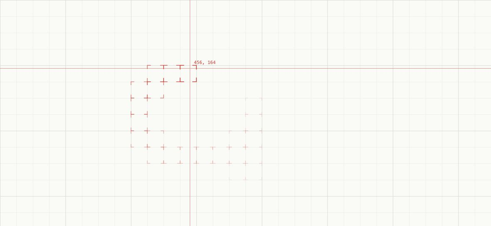
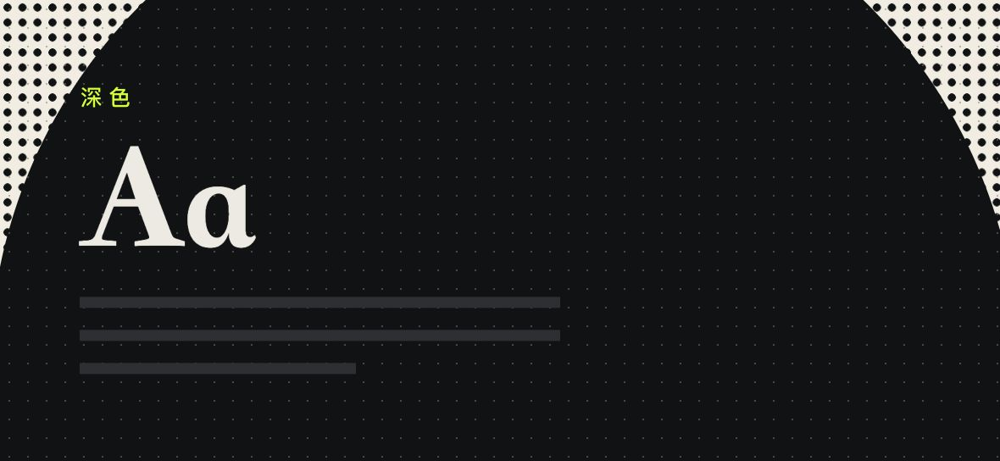
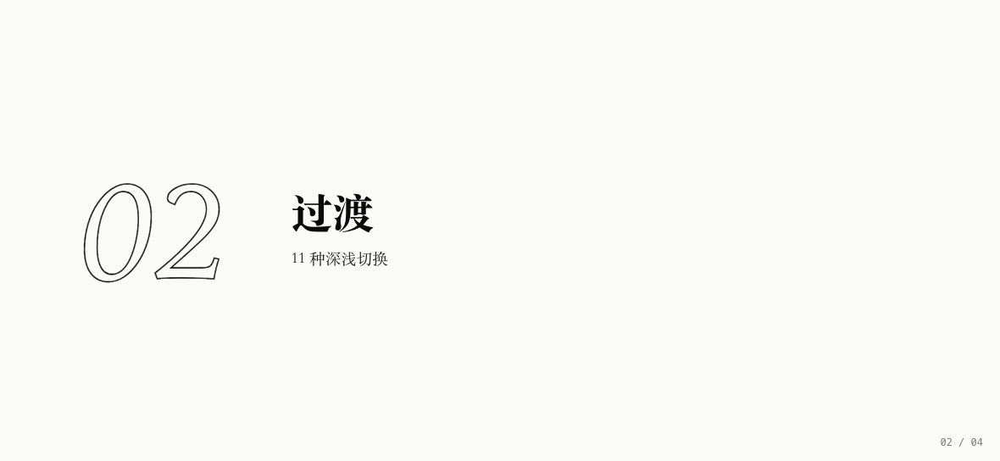
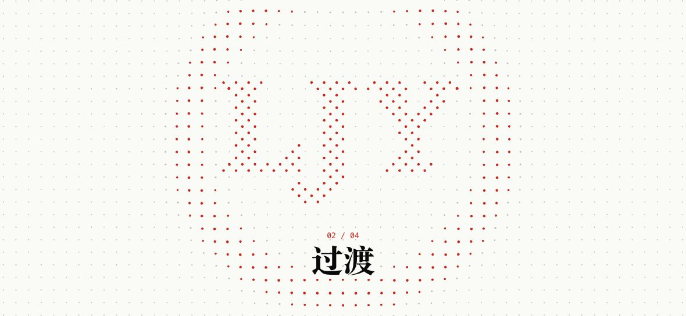

<div align="center">

# MOTION HUB

**网页动效合集 · 背景 / 深浅过渡 / 拉扯翻页 / 片头 / 小交互**

原生 JavaScript · 无依赖 · 无构建 · 23 个效果 · MIT

[作者官网 lijunyu.com.cn](https://lijunyu.com.cn) · 在线演示（部署中）



</div>

---

## 这是什么

做个人网站的时候，一个个“能动的小想法”被做了出来：会漂移的等高线、被鼠标推开的点阵、从点击处扩散的深浅切换、被扯长再拽走的翻页……Motion Hub 把它们收在一起，做成一个**实验台**：

- **左边**是全部效果的名单，按分类编号；
- **右边的舞台**全尺寸实时运行当前效果，没人操作时有一个“幽灵光标”自己演示，一动鼠标就交还给你；
- **下面**是说明、用到的技术，以及一键复制的完整代码（存成 `.html` 就能打开）。

右上角的深浅开关本身也是演示：正在看哪一种过渡，整页就用哪一种切换。



## 效果一览

<table>
<tr>
<td width="33%"><br><b>等高线</b><br><sub>Perlin 噪声地形 + Marching Squares；鼠标处隆起，点击荡开波纹</sub></td>
<td width="33%"><br><b>磁性点阵</b><br><sub>弹簧阻尼；被推开的点变大、变成强调色，点击发出冲击波</sub></td>
<td width="33%"><br><b>坐标网格</b><br><sub>十字准线 + 实时坐标；经过的格子亮起角标再冷却</sub></td>
</tr>
<tr>
<td><br><b>点阵扩散</b><br><sub>深浅切换：前沿是一圈网点，后面才是实心</sub></td>
<td><br><b>拉扯翻页</b><br><sub>信息被扯长再拽走，背景不动；可以按住拖动</sub></td>
<td><br><b>点阵拼字片头</b><br><sub>点从屏幕外飞进来拼成文字，字幕依次闪过并荡开波纹</sub></td>
</tr>
</table>

| 分类 | 数量 | 效果 |
|---|:---:|---|
| 背景 | 5 | 等高线 · 磁性点阵 · 安静点阵 · 风场 · 坐标网格 |
| 过渡 | 11 | 圆形揭开 · 墨水晕开 · 点阵扩散 · 百叶窗 · 斜切扫过 · 光圈快门 · 液面上涨 · 网点溶解 · 柔光圆 · 翻页 · 淡入淡出 |
| 翻页 | 1 | 拉扯翻页 |
| 片头 | 1 | 点阵拼字片头 |
| 交互 | 5 | 太阳月亮开关 · 边框高光卡片 · 乱码落定 · 跟随信息卡 · 校验链 |

## 几个有意思的实现

- **拉扯翻页**：把要被扯走的那一页复制一份、横切成几十条，每条按离“抓点”的距离做指数衰减的竖向位移和拉伸，拼起来就是被拉长的样子。只做竖向——横向一缩放，同一个字跨几条时边缘就会错成台阶。
- **点阵扩散**：三层 CSS 遮罩合成，`实心圆 ∪（网点 ∩ 前沿环）`，半径用 `@property` 注册后交给 Web Animations 补间。
- **片头是纯函数**：画面完全由时间 `t` 决定，可以随时跳到结尾、重播、在任意尺寸重画最后一帧，最后一帧直接当首屏背景“定格”。
- **深浅过渡两套实现**：舞台里叠两层小页面，用 WAAPI 做动画，任何尺寸都能跑；整页用 View Transitions。两者共用同一组形状函数。

## 本地运行

```bash
python3 -m http.server 8080      # 访问 http://localhost:8080
```

直接双击 `index.html` 也能用，包括“复制完整代码”。网址可以带上效果 id 直接定位，例如 `#theme-dots`。

<details>
<summary><b>目录结构</b></summary>

```
index.html              实验台
src/core.js             注册表 + 公共工具（噪声、缓动、画布宿主、幽灵光标）
src/effects.css         配色变量 + 各效果样式 + 整页过渡遮罩
src/hub.css             实验台版式
src/sources.js          打包好的源码字符串（“复制完整代码”用，npm run sources 生成）
src/effects/
  backgrounds.js        背景 5 个
  transitions.js        深浅过渡 11 个 + MH.themeSwitch
  pull.js               拉扯翻页
  intro.js              点阵拼字片头
  ui.js                 小交互 5 个
tools/smoke.mjs         冒烟测试
tools/build-sources.mjs 生成 src/sources.js
docs/                   README 用图
```

</details>

<details>
<summary><b>测试</b></summary>

```bash
npm install                         # 只装测试用的 puppeteer-core
npm run smoke                       # 浅色、桌面尺寸
node tools/smoke.mjs --night --mobile
```

无头 Chrome 逐个打开全部效果，检查脚本错误、是否画出内容和帧率。需要本机安装 Chrome，路径不同时用环境变量 `CHROME` 指定。

</details>

<details>
<summary><b>浏览器支持</b></summary>

- 背景、翻页、片头、小交互：近两年的 Chrome / Edge / Safari / Firefox。
- 遮罩类过渡依赖 `@property`（Firefox 128+），不支持时直接切换。
- 整页深浅切换依赖 View Transitions（Chrome / Edge 111+、Safari 18+），不支持时直接切换。
- 系统开启“减少动态效果”时，所有效果只显示静止画面。

</details>

## 许可证

[MIT](LICENSE) · 随便用，商用也可以。
